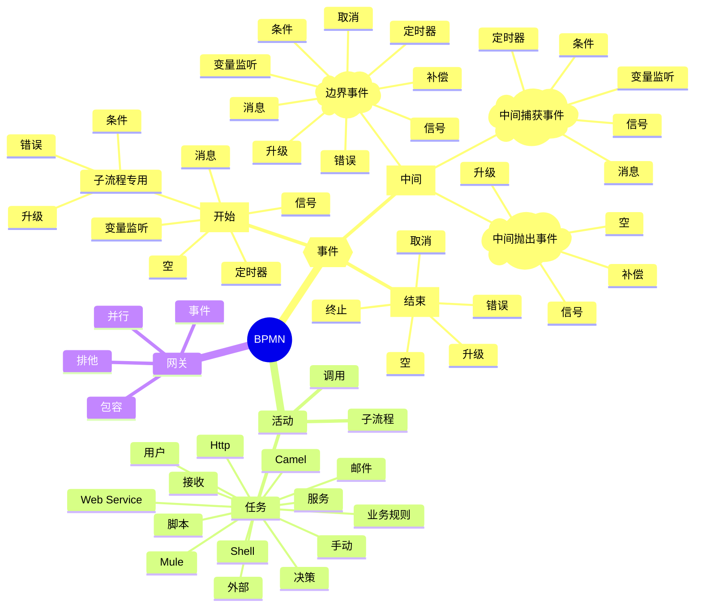

学习工作流引擎，可以首先基于《深入Flowable流程引擎：核心原理与高阶实战》这本书了解基础的概念，这本书是基于flowable6的，目前最新版是7。后者实际上没啥改进，还取消了UI相关部分的开源（进企业版了）。

目前国产工作流引擎中，warm-flow和FlowLong比较完备，后者也有企业版，前者纯开源。前者属于dromara社区，后者是一个叫爱组搭的低代码平台搞的（注意这个开源是有附加协议的），两个都在积极迭代中，本文主要基于前者。

<!--more-->

# BPMN基础知识

首先最重要的是，要熟悉bpmn那些概念和图形符号。

* 网关比较简单，一般用包容网关；
* 任务除了用户任务，其他多用于自动化，里面还包含了规则引擎（决策，配合DMN）的支持，但是性能不足；
* 事件比较复杂，是流程的重要驱动。

## 图例

首先记住上面这张图，基础形状代表了元素的基础类型。

然后是下面这张所有元素[汇总图](https://processmind.com/resources/BPMNPoster/BPMN2_0_Poster_CHN.pdf)，可以打印出来记得看。

其中最难记的就是右上角的事件类，区分点如下：

1. 开始最简单，图标白为主、只有一个圈。如果是虚线，那就要中断；
2. 中间两个圈，抛出图标粗。如果是虚线，那就要中断；
3. 结束圈加粗，图标黑为主；

实际上BPMN的元素非常多，我们一般用的是精简集。

# warm-flow试用

